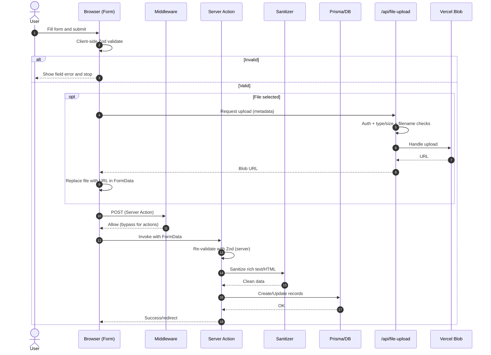

# Architecture overview

- Framework: Next.js App Router (server components + server actions) with TypeScript.
- UI: MUI + custom components in `src/app/ui`.
- Auth: Auth.js email provider using magic links; email sent via Nodemailer (`mail-service`).
- DB: Prisma with PostgreSQL (`prisma/schema.prisma`).
- Files: Vercel Blob for uploads (`/api/file-upload` route + client-side `@vercel/blob/client`).
- Payments: Swedbank Pay integration in `payment-actions.ts` and `payment-utils.ts`.
- Tests: Vitest + Testing Library in `src/__tests__`.
- Security: Middleware checks auth/authorization and sets security headers; additional headers in `next.config.mjs`.

Notable flows

- Sign-in: user enters email -> magic link -> `sendSignInEmail` via SMTP -> NextAuth validates token -> session JWT.
- Payments: create order -> redirect to Swedbank checkout -> callback/complete -> status poll -> order progressed.
- Uploads: File selected in form -> validated clientside -> POST to `/api/file-upload` which validates type/size/auth -> stored in Vercel Blob -> URL saved to DB.
- Forms (submission, validation, sanitization):
    - Client: `Form` component (`src/app/ui/form/Form.tsx`) optionally validates inputs with Zod; file names are sanitized and uploads use `/api/file-upload` (auth + type/size checks) to Vercel Blob.
    - Server: Server Actions receive `FormData`, re-validate with Zod schemas in `src/app/lib/zod-schemas.ts` (defense-in-depth: never trust client).
    - Sanitization: rich text/HTML fields are sanitized with DOMPurify via `sanitizeFormData` / `sanitizeRichText` in `src/app/lib/html-sanitizer.ts` before persisting.
    - Persistence: sanitized, validated payloads are written via Prisma; when updating images, old blobs may be deleted (see `organization-settings-actions.ts`, `product-actions.ts`, etc.).
    - Security/UX: middleware allows Server Action POSTs while protecting pages; API route enforces content type and size; errors surfaced back to UI via notifications; redirects use relative URL helpers from `lib/utils`.

### Forms — sequence diagram

Key files

- `src/middleware.ts` — auth gating + headers
- `src/app/lib/auth/auth.ts` — NextAuth config
- `src/app/lib/**/*.ts` — server actions and helpers
- `prisma/schema.prisma` — data model
- `next.config.mjs` — security headers and image allowlist
